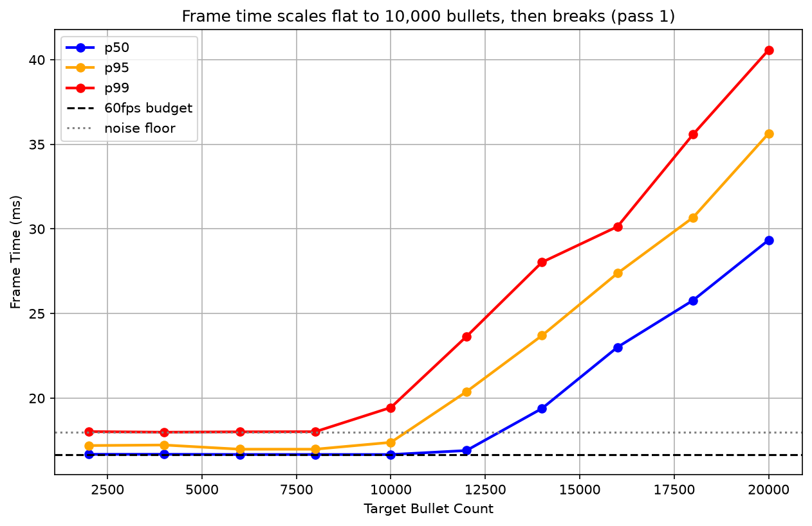
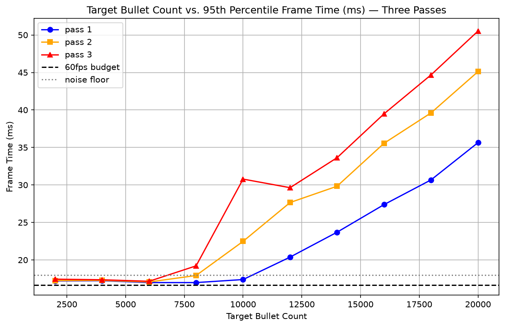
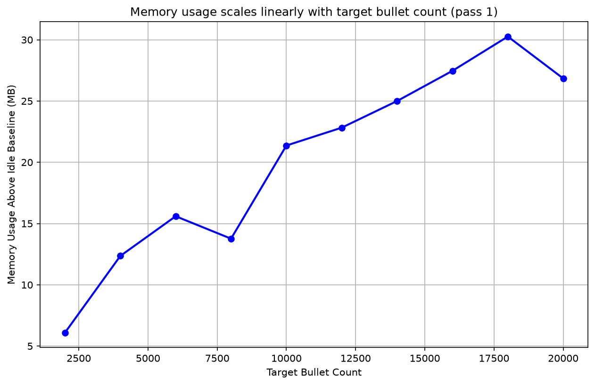
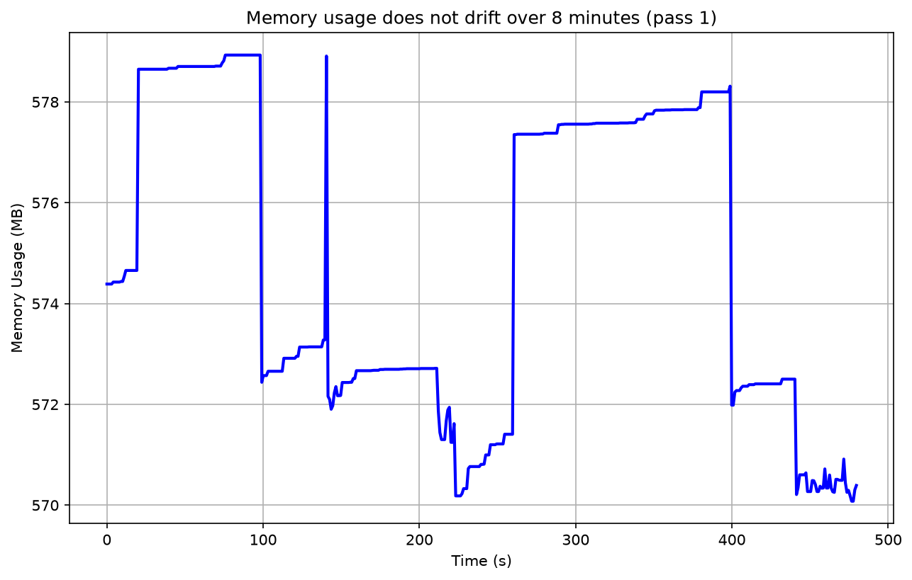
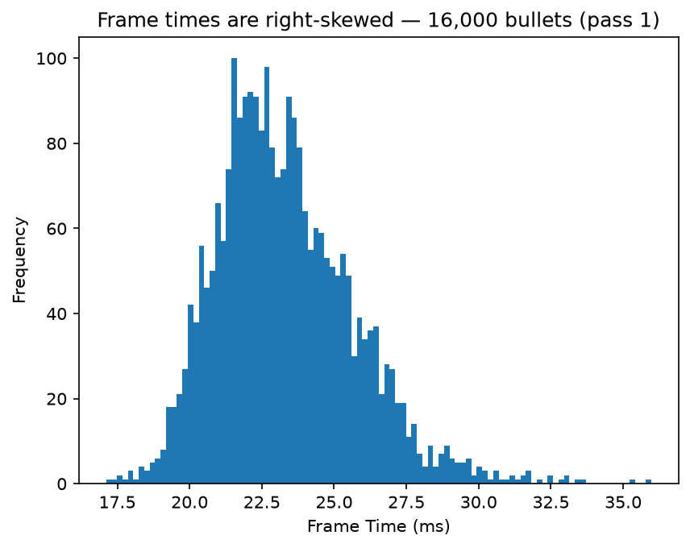

# Roblox Engine Performance Scaling Study

This started from a production problem: a Roblox server with a suspected memory leak and no idea where its capacity ceiling was. I built the instrumentation to find out.

## Question
How does the server frame time scale with the live bullet count, when does the server slow, and does server memory grow unbounded?

## Method
A load generator which loads a certain number of bullets, and a telemetry probe was built in Luau. Measurement happened across three different passes, one server per pass. During each pass, ten load levels of bullets (from 2000 to 20000) were each measured per frame for 60 seconds. This totaled in about 215000 frame samples. While measuring frame samples, memory was also measured per second. Load levels ran in ascending order within each pass, and the lowest level was re-run at the end as a recheck — if anything accumulated over the pass, it would show up as the lowest level reading slower the second time. In addition, another ten minute session happened where a load of 5000 bullets were held constantly for eight minutes, and a load of 0 for the last two minutes. Again, memory was measured per second, and frame time was measured per frame.

## Findings

### Frame time
The frame time was flat at 16.67 ms until the 8000 to 10000 bullet mark, where super linear degradation of frame time happened. Each percentile, p99, p95, and p50, crossed the noise floor at 10000, 12000, and 14000 respectively. The thresholds were 19 ms for p99, and 18 ms for p95 and p50. The reason for the p99 threshold being higher is because the baseline p99 frame time was around 18 ms. Although the heights of the curves and the start of degradation differed between the three, the shape replicated in all three. The p50 to p99 gap did widen, however. It was 1.3 ms at 2000 bullets, but increased to 11.2 ms at 20000. The engine becomes inconsistent with load.

The same test was run on three different servers. At 20000 bullets, p95 varied from 35.6 ms to 50.5 ms, a 15 ms spread between servers. For comparison, doubling the load from 10000 to 20000 bullets on pass 1 raised p95 by 18 ms, from 17.4 ms to 35.6 ms. Switching servers costs about as much frame time as doubling the bullet count.

Roblox allocates server CPU dynamically based on player count, so a solo server may sit at the low end of that range. This could contribute to the spread alongside physical hardware differences, though this study didn't measure allocation directly. ([source](https://devforum.roblox.com/t/launching-even-more-server-cpu/4044040))





### Memory
Server memory did not drift at a constant load, and there was no instance retention (bullets were pure luau tables). Each bullet contributed to about 1.7 kb of server memory. The suspected unbounded growth did not appear at the sensitivity this test could reach — see Limitation 4 for what that sensitivity is.





## Why percentiles, not standard deviation
The frame time distribution is skewed right, with a long tail of slow frames. Percentiles describe that honestly; a mean and standard deviation would not.



## Limitations
1. Each load vs frame time curve shows the same shape, but three servers can't represent Roblox hardware overall.
2. The projectiles were identical, they hit nothing, and it was a single player server. It measures how the system scales, not what real gameplay is like.
3. The recheck target sits below the knee where the scheduler absorbs the cost, so it can only detect accumulation that is large enough to push the level off the floor.
4. The 2 minute tail at the end can't separate allocator retention from a slow leak. The tails varied from +25 to +35 MB which is consistent with allocator retention.

## Future work
Some future work that would be helpful would be a player count axis, as the game allows 40 players. A mixed load where bullets terminate would be necessary as well. As mentioned before, a longer tail at the end would help determine if the GC (garbage collector) did not act, or if it was a slow leak, and more servers would give a better understanding of server hardware variance.

## Repo Contents
```
data/           raw telemetry (Frame and Memory tabs)
notebooks/      analysis.ipynb
plots/          exported figures
```